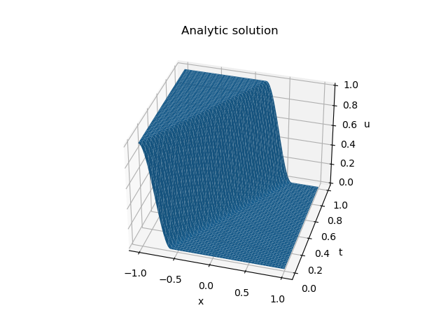

# Using physics-informed neural networks to solve the advection equation

## Background

Physics-informed neural networks (PINNs) were [introduced](https://www.sciencedirect.com/science/article/pii/S0021999118307125) by Raissi, Perdikaris and Karniadakis in 2019, as a method of finding numerical solutions to continuous and discrete-time partial differential equations, as well as parameterising those equations using data.  In this repository, I want to concentrate on the case of finding a numerical solution to the continuous-time advection equation.  No doubt this has been done my many other authors, but I'm trying to teach myself!

## Required packages

Python with [TensorFlow](https://www.tensorflow.org/) is used to solve the PINNs in this repository.  To run the python scripts, `matplotlib` and `tensorflow` are needed.  Install them using, for instance,

```
conda install -c conda-forge tensorflow
conda install -c conda-forge matplotlib
```

## Basic concept of the PINNs approach

The approach assumes that the dynamics of a system are described by a differential equation

##
N(u) = 0
##

Here, $N$ is a differential operator, which is possibly nonlinear, and $u$ describes the system.  For instance, if $u$ represents temperature of a system, then $N$ might be the heat equation: $\mathrm{d}u/\mathrm{d}t = k\nabla^{2}u$.  The solution of $N(u)=0$ also depends on initial and boundary conditions

$$
B(u) = 0
$$

For instance, in the heat equation case, a uniform $u - 293 = 0$ might be the initial condition, and $\nabla_{n} u - 1 = 0$ might be prescribed on the boundaries (here $n$ is the normal to the boundary, and physically this means that the boundaries are providing a source of heat).  It is assumed that there is a unique solution to this physical setup.

The PINN approach builds a standard neural network that outputs $u$, given space-time coordinates.  What is unique in the PINN approach is that the loss function is

$$
\mathrm{Loss} = a |N(u)| + b |B(u)|
$$

Here the $|\cdot|$ notation indicates some norm.  For instance, $|N(u)| = \sum_{t, x}|N(u(t, x))|^{2}$, where the sum runs over some points in the interior of the space-time domain.  Similarly, $|B(u)| = \sum_{t_{\ast}, x_{\ast}}|B(u(t_{\ast}, x_{\ast}))|^{2}$, where the sum runs over some points on the boundary of the space-time domain.  Note the fundamental difference with usual neural networks: *the loss depends on derivatives of the neural network's output value with respect to its input values*.  These derivatives are calculated using automatic differentiation.

The remainder of the PINN approach appears to be just gloss (albeit, very important gloss that may critically influence convergence).  The critical point is that the loss function is unusual.

## The advection equation

The advection equation in 1 spatial dimension is

$$
\frac{\partial u}{\partial t} = -\frac{\partial}{\partial x} (vu) \ .
$$

Here:

- $t$ is time
- $x$ is the spatial coordinate
- $u = u(t, x)$ is the thing we're trying to find.  It could represent temperature of a fluid, or concentration of a pollutant, for instance
- $v$ is the advection velocity.  It could be the velocity of the fluid, for instance.  Assume it is independent of $x$ and $t$.

The analytical solution of the advection equation is

$$
u = f(x - vt) \ ,
$$

where $u(0, x) = f(x)$ is the initial configuration of $u$ (the temperature distribution at $t=0$, for instance).  This is the solution that the PINN should produce.

The reason for choosing the advection equation is that its analytical solution is known and straightfoward, and that the advection equation is [quite tricky to solve using standard numerical techniques](https://mooseframework.inl.gov/modules/porous_flow/stabilization.html).  In naive schemes, the numerical solution suffers from over-shoots and under-shoots.  For instance, if the initial condition satisfies

$$
0 < f < 1 \ ,
$$

then at later times the numerical solution breaks these bounds ($u < 0$ and/or $u > 1$).  To get around this, many numerical schemes introduce "numerical diffusion", but if care is not taken, this means that after some time the numerical solution is $u = $ constant, independent of the initial condition.  (An animation may be found [here](https://mooseframework.inl.gov/modules/porous_flow/numerical_diffusion.html).)  Of course, numerical techniques to get around these problems are known, but the advection equation is not as simple as expected.  Do PINNs suffer any difficulties?

## The specific problem explored here

Assume the spatial domain is bounded: $-1 \leq x \leq 1$.  Assume the initial condition is

$$u(0, x) = f(x) = \left\\{
\begin{array}{ll}
1 & x \leq -1 \\
\frac{1}{2} + \frac{(x + 1 - w)((x + 1 - w)^{2} - 3w^{2})}{4w^{3}} & -1 < x < -1 + 2w \\
0 & x \geq -1 + 2w
\end{array}\right.
$$

Here $w$ is the "window size".  The nasty-looking cubic is chosen so that $f$ smoothly transitions from 1 (at $x\leq -1$) to 0 (for $x\geq -1 + 2w$), that is, $f$ is differentiable.  As $w\rightarrow 0$, $f$ tends to a step function (see figures below).

Assume the boundary conditions are Dirichlet (fixed value) on the left:

$$
u(t, -1) = 1 \ ,
$$

and Neumann (fixed flux, which is zero in this case) on the right:

$$
\frac{\partial}{\partial x}u(t, 1) = 0 \ .
$$

Assume the velocity, $v = 1.2$.  The analytic solution is $u(t, x) = f(x - vt)$.  This is shown in the following plots.




## A primer: integrating a function

As a primer for the advection problem, consider building a neural network to find $u$, where the derivative of $u$ is known.  That is, given $f(x)$, find $u(x)$ such that

$$
\frac{\mathrm{d}u}{\mathrm{d}x} = f(x) \ .
$$

This means the neural network is integrating the function $f$.  In addition, assume that $u(0) = u_{0}$, where $u_{0}$ is specified, which fixes the constant of integration.  For ease of presentation, assume that $0 \leq x$.  Note that these two conditions are directly analogous to the general PDE situation solved by PINNs, in particular:

- $\mathrm{d}u/\mathrm{d}x = f$ is equivalent to the PDE
- $u(0) = u_{0}$ is equivalent to the boundary and initial conditions.

This problem is different than usual nonlinear regression using a neural network.  In the usual case, the values, $u$, are known at certain $x$ points, and the neural network is trained to produce these values.  Nevertheless, most of the usual neural-network architecture can be used for this integration problem.  All that is required is to build an appropriate loss function, and the usual netural-network machinery is used find the solution.

The code to perform the integration is in [integrate.py](integrate.py).

The loss function is a linear combination of the conditions $\mathrm{d}u/\mathrm{d}x - f = 0$ and $u(0) - u_{0} = 0$.  The former uses TensorFlow's automatic differentiation (in this code snippet, `x` are the points on the domain at which the `function_values` ($f$) are known):

```
def loss_de(x, function_values):
    ''' Returns sum_over_x(|du/dx - function_values|^2) / number_of_x_points
    '''
    # First, use TensorFlow automatic differentiation to evaluate du/dx, at the points x, where u is given by the NN model
    with tf.GradientTape(persistent = True) as tp:
        tp.watch(x)
        u = model(x) # "model" is the NN's output value, given x
    u_x = tp.gradient(u, x)
    del tp
    # The loss is just the mean-squared du/dx - function_values
    return tf.reduce_mean(tf.square(u_x - function_values))
```

The constraint $u(0) - u_{0} = 0$ is encoded as (in this code snippet, `x` are the points on the domain, recall $0 \leq x$) :

```
def loss_bdy(x, val_at_zero):
    ''' Evaluate the boundary condition, ie u(0) - val_at_zero, where u is given by the NN model
    '''
    val = model(tf.convert_to_tensor([x[0]], dtype = tf.float32)) - val_at_zero # "model" is the NN predicted value, given x
    return tf.reduce_mean(tf.square(val))
```

Finally, the loss used in the neural-network training process is a weighted linear combination of these (in this code snippet, `X` are the points on the domain at which the `fcn` values ($f$) are known, and `value_at_0` is $u_{0}$):

```
@tf.function # decorate for speed
def loss(ytrue, ypred):
    ''' The loss used by the training algorithm.  Note that ytrue and ypred are not used,
    but TensorFlow specifies these arguments
    '''
    bdy_weight = 1
    de_weight = 1
    return bdy_weight * loss_bdy(X, value_at_0) + de_weight * loss_de(X, fcn)
```

The following figure shows the result for $f(x) = \cos(x)$ and $u_{0} = 0.7$:


## The PINN

The PINN must have two inputs, $(t, x)$, and one output, $u$.  Raissi, Perdikaris and Karniadakis state that the PINN must be of sufficient complexity to be able to represent the solution, $u$.  For the advection problem described above, the following neural network is sufficient:

```
depth = 5           # depth of NN
width = 10          # width of fully-connected NN
activation = 'relu' # alternatives 'selu', 'softplus', 'sigmoid', 'tanh', 'elu', 'relu'
epochs = 1000       # training epochs
batch_size = 1000   # batch size
model = Sequential()
model.add(Dense(width, kernel_initializer = 'normal', activation = activation, input_shape = (2, )))
for d in range(1, depth):
    model.add(Dense(width, kernel_initializer = 'normal', activation = activation))
model.add(Dense(1, kernel_initializer = 'normal', activation = activation))
```

In order to evaluate the loss function, points on the space-time boundary as well as its interior need to be defined.  The initial conditions, boundary conditions and the advection equation are evaluated (using the neural network) at these points.  In the following code snipped the `front` function is the cubic defined above.

```
num_initial = 10000
num_dirichlet = 101
num_neumann = 102
num_interior = 10000
T_initial = tf.constant([0] * num_initial, dtype = tf.float32)
X_initial = tf.random.uniform(shape = [num_initial], minval = -1, maxval = 1, dtype = tf.float32)
vals_initial = front(X_initial)
T_dirichlet = tf.random.uniform(shape = [num_dirichlet], minval = 0, maxval = 1, dtype = tf.float32)
X_dirichlet = tf.constant([-1] * num_dirichlet, dtype = tf.float32)
vals_dirichlet = tf.constant([1] * num_dirichlet, dtype = tf.float32)
T_neumann = tf.random.uniform(shape = [num_neumann], minval = 0, maxval = 1, dtype = tf.float32)
X_neumann = tf.constant([1] * num_neumann, dtype = tf.float32)
flux_neumann = tf.constant([0] * num_neumann, dtype = tf.float32)
T_interior = tf.random.uniform(shape = [num_interior], minval = 0, maxval = 1, dtype = tf.float32)
X_interior = tf.random.uniform(shape = [num_interior], minval = -1, maxval = 1, dtype = tf.float32)
```

The loss function is a weighted sum of four terms.  The first two are the initial condition (evaluated at `(T_initial, X_initial)`) and the Dirichlet boundary condition (evaluated at `(T_dirichlet, X_dirichlet)`), as implemented by:

```
def loss_dirichlet(t, x, u_desired):
    ''' Evaluate the initial condition or Dirichlet boundary condition (both are "fixed u" conditions), ie
    sum_over(t, x)(|u - u_desired|^2) / number_of_(t, x)_points, where u is given by the NN model
    '''
    u_vals = tf.reshape(model(tf.stack([t, x], 1)), [len(t)]) # "model" is the NN predicted value, given (t, x)
    return tf.reduce_mean(tf.square(u_vals - u_desired))
```

The third is the Neumann condition (evaluated at `(T_neumann, X_neumann)`):

```
def loss_neumann(t, x, flux_desired):
    ''' Evaluate the Neumann boundary condition, ie
    sum_over(t, x)(|du/dx - flux_desired|^2) / number_of_(t, x)_points, where u is given by the NN model
    '''
    # First, use TensorFlow automatic differentiation to evaluate du/dx, at the points (t, x), where u is given by the NN model
    with tf.GradientTape(persistent = True) as tp:
        tp.watch(x)
        u = model(tf.stack([t, x], 1)) # "model" is the NN predicted value, u, given (t, x)
    u_x = tp.gradient(u, x)
    del tp
    # Now return the loss
    return tf.reduce_mean(tf.square(u_x - flux_desired))
```

The fourth term is the advection equation (evaluated at `(T_interior, X_interior)`):

```
def loss_de(t, x):
    ''' Returns sum_over_(t, x)(|du/dt + velocity * du/dx|^2) / number_of_(t, x)_points
    '''
    # First, use TensorFlow automatic differentiation to evaluate du/dt and du/dx, at the points (t, x), where u is given by the NN model
    with tf.GradientTape(persistent = True) as tp:
        tp.watch(t)
        tp.watch(x)
        u = model(tf.stack([t, x], 1)) # "model" is the NN predicted value, u, given (t, x)
    u_t = tp.gradient(u, t)
    u_x = tp.gradient(u, x)
    del tp
    # The loss is just the mean-squared du/dt + velocity * du/dx
    return tf.reduce_mean(tf.square(u_t + velocity * u_x))
```

These four terms contribute to the overall loss function:

```
@tf.function # decorate for speed
def loss(ytrue, ypred):
    ''' The loss used by the training algorithm.  Note that ytrue and ypred are not used,
    but TensorFlow specifies these arguments
    '''
    weight_initial = 1
    weight_dirichlet = 1
    weight_neumann = 1
    weight_de = 1
    return weight_initial * loss_dirichlet(T_initial, X_initial, vals_initial) + weight_dirichlet * loss_dirichlet(T_dirichlet, X_dirichlet, vals_dirichlet) + weight_neumann * loss_neumann(T_neumann, X_neumann, flux_neumann) + weight_de * loss_de(T_interior, X_interior)
```

Now it is simply a matter of compiling the neural network specifying this loss function, and training in the usual way:

```
    model.compile(loss = loss, optimizer = 'adam') # note the specification of the loss function
    # Note that the dummy values are not used in the training because the loss function uses different arguments.
    dummy_tx = [[0, 0]]
    dummy_true = [0]
    history = model.fit(dummy_tx, dummy_true, epochs = epochs, batch_size = batch_size, verbose = 1)
```

The results are pleasing!


## Comments/Questions

- Obviously, the boundary conditions need not be at the boundary, and these could be experimental measurements of some quantity.
- Is the PINN approach any better (computationally cheaper, more accurate, more robust) than: (a) finite-element; (b) using something else like a bunch of radial basis functions?
- In some cases, an explicit time-stepping approach is advantageous to ensure robustness.  Would the PINN approach that is solving "everything, everywhere, all at once" actually work?
- Could adaptive positioning of the points reduce computational time?
- How is something like mass conservation implemented?
- How about known fluxes (from an injector inside the domain, or from the boundary) - can randomly-placed points really ensure the correct total flux?
- Could PINNs be re-jigged to do explicit time-stepping?


