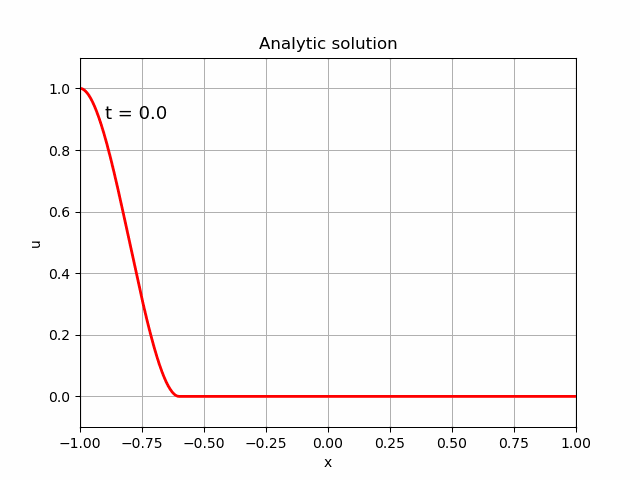

# Using physics-informed neural networks to solve the advection equation

## Background

Physics-informed neural networks (PINNs) were [introduced](https://www.sciencedirect.com/science/article/pii/S0021999118307125) by Raissi, Perdikaris and Karniadakis in 2019, as a method of finding numerical solutions to continuous and discrete-time partial differential equations, as well as parameterising those equations using data.  In this repository, I concentrate on

- [finding a numerical solution to the continuous-time advection equation](#forward) (the "forward" problem);
- [parameterising the advection equation using observations](#paramid) (the "inverse" problem).  There is a [challenge](#inv_challenge) for readers to solve!

No doubt these have been done my many other authors, but I'm trying to teach myself!

Towards the end of this page, I outline another feature of Raissi, Perdikaris and Karniadakis's work, namely [discrete time integration via Runge-Kutta](#rungekutta).  This appears to be startling novel and important, but I only summarise it here.

<a name="req"></a>
## Required packages

Python with [TensorFlow](https://www.tensorflow.org/) is used to solve the PINNs in this repository.  To run the python scripts, `matplotlib` and `tensorflow` are needed.  Install them using, for instance,

```
conda install -c conda-forge tensorflow
conda install -c conda-forge matplotlib
```

## Basic concept of the PINNs approach

The approach assumes that the dynamics of a system are described by a differential equation

$$
N(u) = 0
$$

Here, $N$ is a differential operator, which is possibly nonlinear, and $u$ describes the system.  For instance, if $u$ represents temperature of a system, then $N$ might be the heat equation: $\mathrm{d}u/\mathrm{d}t = k\nabla^{2}u$.  The solution of $N(u)=0$ also depends on initial and boundary conditions

$$
B(u) = 0
$$

For instance, in the heat equation case, a uniform $u - 293 = 0$ might be the initial condition, and $\nabla_{n} u - 1 = 0$ might be prescribed on the boundaries (here $n$ is the normal to the boundary, and physically this means that the boundaries are providing a source of heat).  It is assumed that there is a unique solution to this physical setup, and that it is well-posed.

The PINN approach builds a standard neural network that outputs $u$, given space-time coordinates.  What is unique in the PINN approach is that the loss function is

$$
\mathrm{Loss} = a |N(u)| + b |B(u)|
$$

Here the $|\cdot|$ notation indicates some norm.  For instance, $|N(u)| = \mathrm{mean} |N(u(t, x))|^{2}$, where the mean is taken over some points in the interior of the space-time domain.  Similarly, $|B(u)| = \mathrm{mean} |B(u(t_{\ast}, x_{\ast}))|^{2}$, where the mean is taken over some points on the boundary of the space-time domain (denoted with an asterisk).  Note the fundamental difference with usual neural networks: *the loss depends on derivatives of the neural network's output value with respect to its input values*.

These derivatives are calculated using automatic differentiation.  It is easy to differentiate a single activation function with respect to its input.  Automatic differentiation is just doing that derivative, and using heaps of chain rules to propagate the differential operator through the entire neural network.  So, automatic differentiation can easily give $N(u)$, given $(t, x)$.

An alternate view of this is that the (automatic) differentiation of the original neural network gives another neural network: one that outputs $N$, given $(t, x)$, for instance.  Then that new neural network is provided with a standard loss function that enforces N = output = 0.

The remainder of the PINN approach appears to be just "gloss".  This "gloss" may critically influence convergence in many cases, so may be practically vital, but it is not the focus of this page.  For instance, Raissi, Perdikaris and Karniadakis use automatic differentiation to find the derivatives of the neural network with respect to its internal parameters (biases and weights) and hence use a Newton method to converge.  However, this "gloss" is not the focus of this page: the critical point is that the loss function is unusual.

## A primer: integrating a function

As a primer for the advection problem, consider building a neural network to find $u$, where the derivative of $u$ is known.  That is, given $f(x)$, find $u(x)$ such that

$$
\frac{\mathrm{d}u}{\mathrm{d}x} = f(x) \ .
$$

This means the neural network is integrating the function $f$.  In addition, assume that $u(0) = u_{0}$, where $u_{0}$ is specified, which fixes the constant of integration.  For ease of presentation, assume that $0 \leq x$.  Note that these two conditions are directly analogous to the general PDE situation solved by PINNs, in particular:

- $\mathrm{d}u/\mathrm{d}x = f$ is equivalent to the PDE
- $u(0) = u_{0}$ is equivalent to the boundary and initial conditions.

This problem is different than usual nonlinear regression using a neural network.  In the usual case, the values, $u$, are known at certain $x$ points, and the neural network is trained to produce these values.  Nevertheless, most of the usual neural-network architecture can be used for this integration problem.  All that is required is to build an appropriate loss function, and the usual netural-network machinery is used find the solution.

The code to perform the integration is in [integrate.py](integrate.py).

The loss function is a linear combination of the conditions $\mathrm{d}u/\mathrm{d}x - f = 0$ and $u(0) - u_{0} = 0$.  The former uses TensorFlow's automatic differentiation (in this code snippet, `x` are the points on the domain at which the `function_values` ($f$) are known):

```
def loss_de(x, function_values):
    ''' Returns sum_over_x(|du/dx - function_values|^2) / number_of_x_points
    '''
    # First, use TensorFlow automatic differentiation to evaluate du/dx, at the points x, where u is given by the NN model
    with tf.GradientTape(persistent = True) as tp:
        tp.watch(x)
        u = model(x) # "model" is the NN's output value, given x
    u_x = tp.gradient(u, x)
    del tp
    # The loss is just the mean-squared du/dx - function_values
    return tf.reduce_mean(tf.square(u_x - function_values))
```

The constraint $u(0) - u_{0} = 0$ is encoded as (in this code snippet, `x` are the points on the domain, recall $0 \leq x$) :

```
def loss_bdy(x, val_at_zero):
    ''' Evaluate the boundary condition, ie u(0) - val_at_zero, where u is given by the NN model
    '''
    val = model(tf.convert_to_tensor([x[0]], dtype = tf.float32)) - val_at_zero # "model" is the NN predicted value, given x
    return tf.reduce_mean(tf.square(val))
```

Finally, the loss used in the neural-network training process is a weighted linear combination of these (in this code snippet, `X` are the points on the domain at which the `fcn` values ($f$) are known, and `value_at_0` is $u_{0}$):

```
@tf.function # decorate for speed
def loss(ytrue, ypred):
    ''' The loss used by the training algorithm.  Note that ytrue and ypred are not used,
    but TensorFlow specifies these arguments
    '''
    bdy_weight = 1
    de_weight = 1
    return bdy_weight * loss_bdy(X, value_at_0) + de_weight * loss_de(X, fcn)
```

The following figure shows the result for $f(x) = \cos(x)$ and $u_{0} = 0.7$:


<a name="forward"></a>
## The advection equation

The advection equation in 1 spatial dimension is

$$
\frac{\partial u}{\partial t} = -\frac{\partial}{\partial x} (vu) \ .
$$

Here:

- $t$ is time
- $x$ is the spatial coordinate
- $u = u(t, x)$ is the thing we're trying to find.  It could represent temperature of a fluid, or concentration of a pollutant, for instance
- $v$ is the advection velocity.  It could be the velocity of the fluid, for instance.  Assume it is independent of $x$ and $t$.

The analytical solution of the advection equation is

$$
u = f(x - vt) \ ,
$$

where $u(0, x) = f(x)$ is the initial configuration of $u$ (the temperature distribution at $t=0$, for instance).  This is the solution that the PINN should produce.

The reason for choosing the advection equation is that its analytical solution is known and straightfoward, and that the advection equation is [quite tricky to solve using standard numerical techniques](https://mooseframework.inl.gov/modules/porous_flow/stabilization.html).  In naive schemes, the numerical solution suffers from over-shoots and under-shoots.  For instance, if the initial condition satisfies

$$
0 < f < 1 \ ,
$$

then at later times the numerical solution breaks these bounds ($u < 0$ and/or $u > 1$).  To get around this, many numerical schemes introduce "numerical diffusion", but if care is not taken, this means that after some time the numerical solution is $u = $ constant, independent of the initial condition.  (An animation may be found [here](https://mooseframework.inl.gov/modules/porous_flow/numerical_diffusion.html).)  Of course, numerical techniques to get around these problems are known, but the advection equation is not as simple as expected.  Do PINNs suffer any difficulties?

## The specific problem explored here

Assume the spatial domain is bounded: $-1 \leq x \leq 1$.  Assume the initial condition is

$$u(0, x) = f(x) = \left\\{
\begin{array}{ll}
1 & x \leq -1 \\
\frac{1}{2} + \frac{(x + 1 - w)((x + 1 - w)^{2} - 3w^{2})}{4w^{3}} & -1 < x < -1 + 2w \\
0 & x \geq -1 + 2w
\end{array}\right.
$$

Here $w$ is the "window size".  The nasty-looking cubic is chosen so that $f$ smoothly transitions from 1 (at $x\leq -1$) to 0 (for $x\geq -1 + 2w$), that is, $f$ is differentiable.  As $w\rightarrow 0$, $f$ tends to a step function (see figures below).

Assume the boundary conditions are Dirichlet (fixed value) on the left:

$$
u(t, -1) = 1 \ ,
$$

and Neumann (fixed flux, which is zero in this case) on the right:

$$
\frac{\partial}{\partial x}u(t, 1) = 0 \ .
$$

Assume the velocity, $v = 1.2$.  The analytic solution is $u(t, x) = f(x - vt)$.  This is shown in the following plots.





## The PINN

The PINN must have two inputs, $(t, x)$, and one output, $u$.  Raissi, Perdikaris and Karniadakis state that the PINN must be of sufficient complexity to be able to represent the solution, $u$.  For the advection problem described above, the following neural network is sufficient:

```
depth = 5           # depth of NN
width = 10          # width of fully-connected NN
activation = 'relu' # alternatives 'selu', 'softplus', 'sigmoid', 'tanh', 'elu', 'relu'
epochs = 1000       # training epochs
batch_size = 1000   # batch size
model = Sequential()
model.add(Dense(width, kernel_initializer = 'normal', activation = activation, input_shape = (2, )))
for d in range(1, depth):
    model.add(Dense(width, kernel_initializer = 'normal', activation = activation))
model.add(Dense(1, kernel_initializer = 'normal', activation = activation))
```

In order to evaluate the loss function, points on the space-time boundary as well as its interior need to be defined.  The initial conditions, boundary conditions and the advection equation are evaluated (using the neural network) at these points.  In the following code snipped the `front` function is the cubic defined above.

```
num_initial = 10000
num_dirichlet = 101
num_neumann = 102
num_interior = 10000
T_initial = tf.constant([0] * num_initial, dtype = tf.float32)
X_initial = tf.random.uniform(shape = [num_initial], minval = -1, maxval = 1, dtype = tf.float32)
vals_initial = front(X_initial)
T_dirichlet = tf.random.uniform(shape = [num_dirichlet], minval = 0, maxval = 1, dtype = tf.float32)
X_dirichlet = tf.constant([-1] * num_dirichlet, dtype = tf.float32)
vals_dirichlet = tf.constant([1] * num_dirichlet, dtype = tf.float32)
T_neumann = tf.random.uniform(shape = [num_neumann], minval = 0, maxval = 1, dtype = tf.float32)
X_neumann = tf.constant([1] * num_neumann, dtype = tf.float32)
flux_neumann = tf.constant([0] * num_neumann, dtype = tf.float32)
T_interior = tf.random.uniform(shape = [num_interior], minval = 0, maxval = 1, dtype = tf.float32)
X_interior = tf.random.uniform(shape = [num_interior], minval = -1, maxval = 1, dtype = tf.float32)
```

The loss function is a weighted sum of four terms.  The first two are the initial condition (evaluated at `(T_initial, X_initial)`) and the Dirichlet boundary condition (evaluated at `(T_dirichlet, X_dirichlet)`), as implemented by:

```
def loss_dirichlet(t, x, u_desired):
    ''' Evaluate the initial condition or Dirichlet boundary condition (both are "fixed u" conditions), ie
    sum_over(t, x)(|u - u_desired|^2) / number_of_(t, x)_points, where u is given by the NN model
    '''
    u_vals = tf.reshape(model(tf.stack([t, x], 1)), [len(t)]) # "model" is the NN predicted value, given (t, x)
    return tf.reduce_mean(tf.square(u_vals - u_desired))
```

The third is the Neumann condition (evaluated at `(T_neumann, X_neumann)`):

```
def loss_neumann(t, x, flux_desired):
    ''' Evaluate the Neumann boundary condition, ie
    sum_over(t, x)(|du/dx - flux_desired|^2) / number_of_(t, x)_points, where u is given by the NN model
    '''
    # First, use TensorFlow automatic differentiation to evaluate du/dx, at the points (t, x), where u is given by the NN model
    with tf.GradientTape(persistent = True) as tp:
        tp.watch(x)
        u = model(tf.stack([t, x], 1)) # "model" is the NN predicted value, u, given (t, x)
    u_x = tp.gradient(u, x)
    del tp
    # Now return the loss
    return tf.reduce_mean(tf.square(u_x - flux_desired))
```

The fourth term is the advection equation (evaluated at `(T_interior, X_interior)`):

```
def loss_de(t, x):
    ''' Returns sum_over_(t, x)(|du/dt + velocity * du/dx|^2) / number_of_(t, x)_points
    '''
    # First, use TensorFlow automatic differentiation to evaluate du/dt and du/dx, at the points (t, x), where u is given by the NN model
    with tf.GradientTape(persistent = True) as tp:
        tp.watch(t)
        tp.watch(x)
        u = model(tf.stack([t, x], 1)) # "model" is the NN predicted value, u, given (t, x)
    u_t = tp.gradient(u, t)
    u_x = tp.gradient(u, x)
    del tp
    # The loss is just the mean-squared du/dt + velocity * du/dx
    return tf.reduce_mean(tf.square(u_t + velocity * u_x))
```

These four terms contribute to the overall loss function:

```
@tf.function # decorate for speed
def loss(ytrue, ypred):
    ''' The loss used by the training algorithm.  Note that ytrue and ypred are not used,
    but TensorFlow specifies these arguments
    '''
    weight_initial = 1
    weight_dirichlet = 1
    weight_neumann = 1
    weight_de = 1
    return weight_initial * loss_dirichlet(T_initial, X_initial, vals_initial) + weight_dirichlet * loss_dirichlet(T_dirichlet, X_dirichlet, vals_dirichlet) + weight_neumann * loss_neumann(T_neumann, X_neumann, flux_neumann) + weight_de * loss_de(T_interior, X_interior)
```

Now it is simply a matter of compiling the neural network specifying this loss function, and training in the usual way:

```
    model.compile(loss = loss, optimizer = 'adam') # note the specification of the loss function
    # Note that the dummy values are not used in the training because the loss function uses different arguments.
    dummy_tx = [[0, 0]]
    dummy_true = [0]
    history = model.fit(dummy_tx, dummy_true, epochs = epochs, batch_size = batch_size, verbose = 1)
```

The results are pleasing!


## Comments/Questions

- Obviously, the boundary conditions need not be at the boundary, and these could be experimental measurements of some quantity.  This is related to [parameter identification](#paramid)
- Is the PINN approach any better (computationally cheaper, more accurate, more robust) than: (a) finite-element; (b) using something else like a bunch of radial basis functions?
- In some cases, an explicit time-stepping approach is advantageous to ensure robustness.  Would the PINN approach that is solving "everything, everywhere, all at once" actually work?  This is related to [discrete time integration](#rungekutta)
- Could adaptive positioning of the points reduce computational time and/or increase robustness and/or increase accuracy?
- How is something like mass conservation implemented?
- How about known fluxes (from an injector inside the domain, or from the boundary) - can randomly-placed points really ensure the correct total flux?
- Could PINNs be re-jigged to do explicit time-stepping?   [Yes!](#rungekutta)

<a name="paramid"></a>
## Parameter identification

When the DE contains unknown parameters, $\lambda_{a}$, and there are experimentally-measured data (that may be noisy), the unknown parameters may be identified by ensuring the neural network's output matches the data as closely as possible.  This is known as the "inverse problem".  Some real-life examples are:

- In groundwater models, the speed of groundwater flow is governed by a parameter called "hydraulic conductivity" ($\lambda$ is hydraulic conductivity).  For instance, a blob of sandstone usually has high conductivity, while a blob of clay usually has low conductivity.  Water can pass rapidly through the sand, but moves only very slowly through the clay.  Imagine the situation where groundwater head ($u$) has been measured at various times and places throughout a body of rock that contains a patchwork of sandstone and clay blobs.  The inverse problem is to use those measurements to infer the spatial distribution of hydraulic conductivity, that is, to determine where the sandstone and clay blobs are.
- Populations of mosquitoes are often prescribed a "carrying capacity" ($\lambda$ is carrying capacity), which is the number of mosquitoes when things are in equilibrium (eg, after many generations of breeding and dying).  If the carrying capacity is large, then the mosquito population can grow large, while if the carrying capacity is small, the mosquito population is limited to a small number.  Carrying capacity varies in time.  For instance, in wet summers in Africa, the carrying capacity is large, while in dry winters it is low.  Carrying capacity also varies in space.  For instance, near to population centres with plentiful standing water, the carrying capacity is large, while in the desert, it is small.  The population is dynamic and rarely (or never) achieves it's theoretical equilibrium at the carrying capacity.  Imagine the situation where mosquito numbers ($u$) have been measured at various times and places throughout a landscape.  The inverse problem is to find the carrying capacity as a function of time and space given those observations.

In both these problems, the underyling DE is assumed to be known, but it contains one or more unknown parameters, $\lambda_{a}$.  For instance, groundwater head (the thing that is observed, $u$) is governed by the diffusion equation with diffusivity related to hydraulic conductivity.  Mosquito populations ($u$) are usually governed by complicated DEs, but the simplest is the logistic equation that contains the carrying capacity as its main parameter.  In both of these problems, the object that is measured (groundwater head or mosquito population, $u$), is not the what is desired (conductivity or carrying capacity, $\lambda$) but they are related.

To solve the inverse problem, further terms are added to the loss function:

$$
\mathrm{Loss} = \ldots + \sum_{\mathrm{obs}} a_{\mathrm{obs}}|u(t_{\mathrm{obs}}, x_{\mathrm{obs}}) - u_{\mathrm{obs}}|^{2}
$$

Here, $\ldots$ is the previously-discussed term involving the PDE, $a_{o}$ is a weight for each experimental observation, $u_{\mathrm{obs}}$ is the observation taken at $(t_{\mathrm{obs}}, x_{\mathrm{obs}})$, and $u$ is the value produced by the neural network.

The neural network is trained by finding the optimal paramters in this problem, which are the neural network weights and biases and the $\lambda_{a}$.  The standard method of achieving this appears to be steepest-descent, which relies on evaluating $\partial\mathrm{Loss}/\partial\mathrm{weight}$ and $\partial\mathrm{Loss}/\partial\lambda$.  These are evaluated using automatic differentiation, as explained fully in the next section.

In summary, the procedure described below will:

- find the unknown advection velocity, given some observational data
- solve the advection equation to find $u = u(t, x)$.

## Explicit example of the inverse advection problem

### Generating some observational data

Because the solution of the advection equation is known, as described above, observational data can be easily generated.  The code is [observations.py](observations.py).  No noise is added in this example:

```
velocity = 1.2 # the true velocity, that will be discovered, hopefully, by the inverse process

def front(x):
    window = 0.2
    return tf.where(x <= -1, 1, tf.where(x >= -1 + 2 * window, 0, 0.5 + (x + 1 - window) * (tf.pow(x + 1 - window, 2) - 3 * tf.pow(window, 2)) / 4 / tf.pow(window, 3)))

num_points = 10000
X = tf.random.uniform(shape = [num_points], minval = -1, maxval = 1, dtype = tf.float32).numpy()
T = tf.random.uniform(shape = [num_points], minval = 0, maxval = 1, dtype = tf.float32).numpy()
u = front(X - velocity * T).numpy() # the solution to the advection equation
with open("observations.csv", "w") as f:
    f.write("#true velocity = " + str(velocity) + "\n")
    f.write("T,X,u\n")
    for pt in range(num_points):
        f.write(str(T[pt]) + "," + str(X[pt]) + "," + str(u[pt]) + "\n")
```

### Training a neural network to solve the advection equation and find the unknown advection velocity

The code may be found in [inverse.py](inverse.py).  It is actually very similar to [advection.py](advection.py), but to minimise the loss, the derivatives with respect to the unknown velocity are needed (so that gradient descent can be used to modify the velocity (and neural net weights and biases) to minimise the loss).  This necessitates explicitly defining the weights and biases and the neural network architecture, as well as the gradient-descent.  Hence, things like

```
    model = Sequential()
    model.add(Dense(...))
    model.fit(...)
```

expand to many lines of code.

First, `velocity` is now an unknown variable, so it is defined and initialised using

```
velocity = tf.Variable(0.5, dtype = tf.float32) # advection velocity with initial guess = 0.5
```

The observations are read from file:

```
obs = pd.read_csv("observations.csv", comment = "#")
T_obs = tf.constant(obs['T'], dtype = tf.float32)
X_obs = tf.constant(obs['X'], dtype = tf.float32)
vals_obs = tf.constant(obs['u'], dtype = tf.float32)
```

The various loss functions are the same as for the advection.py case, with `loss_dirichlet` being used to ensure the neural network output matches the observations:

```
def loss_dirichlet(t, x, u_desired):
    ''' Evaluate the observations or Dirichlet boundary condition (both are "fixed u" conditions), ie
    sum_over(t, x)(|u - u_desired|^2) / number_of_(t, x)_points, where u is given by the NN model
    '''
    u_vals = tf.reshape(model(tf.stack([t, x], 1)), [len(t)]) # "model" is the NN predicted value, given (t, x)
    return tf.reduce_mean(tf.square(u_vals - u_desired))
```

The following rather large block of code defines the weights and biases as a whole lot of tf.Variables.  This is in contrast to advection.py, where their definition was hidden inside the lines `model = Sequential()` and `model.add(Dense(...))`.  The weights are Glorot initialised and the biases are initialised to zero.  The reason the weights and biases are explicitly defined is that later they'll appear in the explicit definition of the neural net.  They are also collected into the "params" list, which will appear in $d(\mathrm{loss})/d(\mathrm{params})$ that will be used in the gradient-descent algorithm.

```
depth = 5           # depth of NN
width = 10          # width of fully-connected NN
def glorot_init_weight(in_dim, out_dim):
    return tf.Variable(tf.random.truncated_normal(shape = [in_dim, out_dim], mean = 0.0, stddev = np.sqrt(2.0 / (in_dim + out_dim)), dtype = tf.float32), dtype = tf.float32)
def zero_init_bias(in_dim, out_dim):
    return tf.Variable(tf.zeros(shape = [in_dim, out_dim], dtype = tf.float32), dtype = tf.float32)
weights = [] # all the weights
biases = [] # all the biases
params = [] # all the weights and biases AND THE VELOCITY!
# 2 inputs = (t, x)
w = glorot_init_weight(2, width)
b = zero_init_bias(1, width)
weights.append(w)
biases.append(b)
params.append(w)
params.append(b)
for d in range(1, depth):
    w = glorot_init_weight(width, width)
    b = zero_init_bias(1, width)
    weights.append(w)
    biases.append(b)
    params.append(w)
    params.append(b)
# 1 output =  u
w = glorot_init_weight(width, 1)
b = zero_init_bias(1, 1)
weights.append(w)
biases.append(b)
params.append(w)
params.append(b)
```

Now for a very important line, which is the whole reason for defining everything so explicitly:

```
params.append(velocity)
```

This means that the automatic differentiation used in $d(\mathrm{loss})/d(\mathrm{params})$ will include derivatives with respect to velocity.  This means the gradient descent will try to find the best velocity, which is the value that minimises the loss.

The neural network can now be defined.  It explicitly uses the weights and biases that were just defined, so that $d(\mathrm{loss})/d(\mathrm{params})$ can be used in the gradient descent to find optimal values of the weights and biases.

```
def model(x):
    # This uses the relu activation function.  relu(x) = max(x, 0)
    # Some other alternatives like tanh, relu and softplus could be used
    z = x
    for d in range(depth):
        w = weights[d]
        b = biases[d]
        zp = tf.add(tf.matmul(z, w), b)
        #z = tf.math.log(1 + tf.math.exp(zp))          # softplus activation
        #z = tf.math.tanh(zp)                          # tanh activation
        #z = tf.where(zp > 0, zp, tf.math.exp(zp) - 1) # elu activation
        z = tf.math.maximum(zp, 0)                     # relu activation
    w = weights[depth]
    b = biases[depth]
    zp = tf.add(tf.matmul(z, w), b)
    return tf.math.maximum(zp, 0) # might like to change this activation function if the hidden layers are also changed
```

The following piece of code does one step of the gradient descent.  Note the appearance of $d(\mathrm{loss})/d(\mathrm{params})$, which will mean the params (weights, biases and velocity) will be altered so as to reduce the loss.

```
optimizer = tf.keras.optimizers.Adam()
@tf.function # decorate for speed
def gradient_descent():
    with tf.GradientTape(persistent = True) as tp:
        epoch_loss = loss()
    gradient = tp.gradient(epoch_loss, params) # d(loss)/d(params)
    del tp
    # because params includes weights, biases and velocity, the following line
    # alters all of these to reduce the loss
    optimizer.apply_gradients(zip(gradient, params))
    return epoch_loss
```

The gradient descent is now simple:

```
epochs = 1000 # training epochs
for epoch in range(epochs):
    epoch_loss = gradient_descent()
    print("epoch =", epoch, "loss =", epoch_loss.numpy(), "velocity =", velocity.numpy())
```

### Result

After 1000 training epochs, the algorithm has predicted that velocity = 1.19 (the true value is 1.2) and it has produced a neural network that predicts $u(t, x)$ with little error.


<a name="inv_challenge"></a>
### Challenge!

Another set of observational data is found in [challenge.csv](challenge.csv).  In this set, there are *2 unknown advection velocities*:

- the first velocity applies when $t < 0.5$
- the second velocity applies when $t \geq 0.5$

Can you find these velocities?

You might like to approach this challenge by modifying [inverse.py](inverse.py).  First, try to run `inverse.py`: if you can't then check the [required packages](#req).  The code [inverse.py](inverse.py) can be modified in the following ways:

1. Define a new `tf.Variable` called `velocity_end` that will be active for $t\geq 0.5$.  That is, add another line similar to `velocity = tf.Variable(0.5, dtype = tf.float32)`.
2. Instead of reading the observations from `observations.csv`, use `challenge.csv` instead.  That is, change the line `obs = pd.read_csv("observations.csv", comment = "#")`.
3. Change the PDE, specifically the PDE loss, to include `velocity_end` instead of just `velocity`.  That is, change the snippet `u_t + velocity * u_x` by using `tf.where(t < 0.5, ...)` instead of just `velocity`.
4. Append `velocity_end` to the `params` list in a similar way to `params.append(velocity)`.
5. At the end of each training iteration, print both `velocity` and `velocity_end`.  That is, add to the line `print("epoch =", epoch, "loss =", epoch_loss.numpy()...`.

Now you should be able to run the code.  You'll probably find pretty poor results: look at the loss, particularly the observation loss, to see the algorithm hasn't converged particularly well.  Remember, the animation that is produced shows the PINN result correctly, but the "True" result (black curve) is from the previous case with just one velocity, so can be ignored.  To improve things, you might like to:

- try more training epochs, for instance `epochs = 10000`.  Oh dear, it seems as if the convergence stalls at `loss = 0.05`
- try a different activation function, for instance `tanh` (see the `model(x)` function).  Aha, after 10000 epochs, the loss has reduced to 0.003 when using `tanh`, which is pleasing.
- try weighting the terms in the loss function differently (eg `weight_de`)
- try changing the parameters within the optimizer (the `Adam` parameters)
- try using a different weight and bias initialisation
- experiment with your own ideas!

What are your best values for `velocity` and `velocity_end`?  Hint, the true value of `velocity` is positive, while `velocity_end` is negative.


<a name="rungekutta"></a>
## Discrete time integration

Suppose that the dynamics of a system are described by the differential equation

$$
\frac{\partial u}{\partial t} + S(u) = 0
$$

Here $S$ is a differential operator, which is possibility nonlinear, that involves spatial derivatives only.  Given $u(t, x)$, this section finds $u(t + \Delta t, x)$ for a given $\Delta t$.

The usual fourth-order explicit [Runge-Kutta](https://en.wikipedia.org/wiki/Runge%E2%80%93Kutta_methods) scheme for integrating this is as follows.  Given $u(t, x)$, define four spatially-dependent functions $u^{(1)}$, $u^{(2)}$, $u^{(3)}$ and $u^{(4)}$ by:

$$
\begin{array}{rcl}
u^{(1)}(t, x) & = & u(t, x) \\
u^{(2)}(t + \frac{1}{2}\Delta t, x) & = & u(t, x) - \frac{1}{2} \Delta t\times S(u^{(1)}(t, x)) \\
u^{(3)}(t + \frac{1}{2}\Delta t, x) & = & u(t, x) - \frac{1}{2} \Delta t\times S(u^{(2)}(t + \frac{1}{2}\Delta t, x)) \\
u^{(4)}(t + \Delta t, x) & = & u(t, x) - \Delta t \times S(u^{(3)}(t + \frac{1}{2}\Delta t, x))
\end{array}
$$

Then

$$
u(t + \Delta t, x) = u(t, x) - \Delta t \left[\frac{1}{6}S\left(u^{(1)}(t, x)\right) + \frac{1}{3}S\left(u^{(2)}(t + \frac{1}{2}\Delta t, x)\right) + \frac{1}{3}S\left(u^{(3)}(t + \frac{1}{2}\Delta t, x)\right) + \frac{1}{6}S\left(u^{(4)}(t + \Delta t, x)\right) \right]
$$

In these expressions, the coefficients $1/2$, $1/3$, and $1/6$ are coefficients of the "Butcher tableau" for this fourth-order scheme.  The more general Runge-Kutta scheme with $q$ levels that can be either explicit or implicit (depending on the coefficients in the Butcher tableau) is written

$$
\begin{array}{rcl}
u^{(i)}(t + c_{i}\Delta t, x) & = & u(t, x) - \Delta t\sum a_{ij} S\left(u^{(j)}(t + c_{j}\Delta t, x) \right) \\
u(t + \Delta t, x) & = & u(t, x) - \Delta t \sum b_{j} S\left(u^{(j)}(t + c_{j}\Delta t, x)\right)
\end{array}
$$

Here $i = 1, \ldots , q$, and the sum runs over $j = 1, \ldots , q$.

The simple, yet revolutionary idea of Raissi, Perdikaris and Karniadakis is to build a neural network that has input $x$ (which is a d-dimensional tuple for a problem with $d$ spatial dimensions) and $q + 1$ outputs that are $u^{(i)}(t + c_{i}\Delta t)$ and $u(t + \Delta t)$.  The loss function enforces the above equations:

$$
\mathrm{Loss} = \mathrm{mean}\left\\{ \left( u(t + \Delta t) + \sum_{j=1}^{q}b_{j} S(u^{(j)}) - u(t) \right)^{2} + \sum_{i=1}^{q} \left(u^{(i)} + \Delta t \sum_{j=1}^{q}a_{ij} S(u^{(j)}) - u(t)\right)^{2} \right\\} + \mathrm{bdy}
$$

In this formula, the spatio-temporal dependencies have been mostly supressed for clarity of exposition, and the "mean" runs over all spatial points that are chosen randomly within the domain, as in the advection-equation example.  The "bdy" term in the Loss function are from boundary conditions.  Because the outputs of the neural network, $u^{(i)}$ and $u(t + \Delta t)$ are all approximations to the temporal evolution of $u$, they are all subject to the same boundary conditions as $u$.

The rather dramatic consequence of this scheme is that the number of Runge-Kutta stages, $q$, can be taken rather large (Raissi, Perdikaris and Karniadakis use $q=100$ and estimate their error to be $10^{-20}$) without the usual increase in computational burden: only the final layer of the neural network increases in size.  Employing an implicit method (the $a$ matrix is not lower-triangular) in the traditional setting requires a dense linear solve at each point $x$ (which, for nonlinear systems, $S$, also occurs within an interative nonlinear Newton method), and this is computationally expensive, but in the PINN setting, this computational burden appears to be by-passed.  This means that implicit RK schemes can be used.  Using so-called Gauss-Legendre implicit schemes produces an A-stable result, so allow large time-steps to be used!


